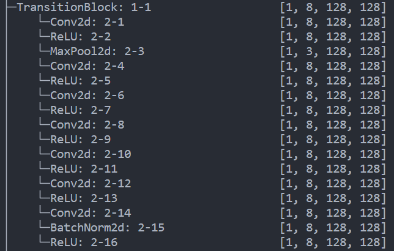
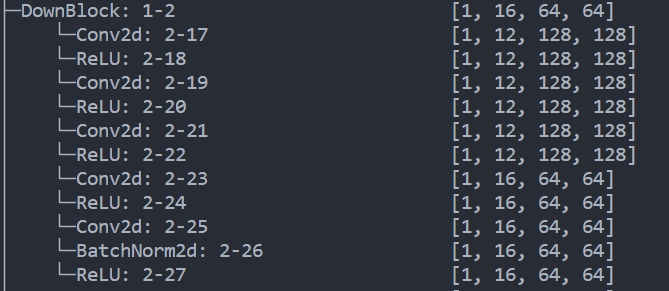
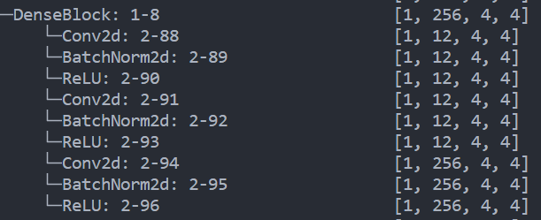
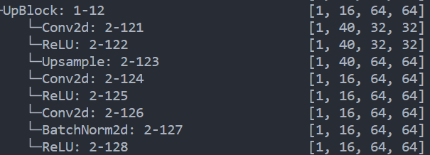

# Unet去噪模型
## 网络结构
### TransitionBlock

### DownBlock

### DenseBlock

### UpBlock

### Unet结构
~~~shell
BaseUNet                                 [1, 3, 128, 128]          
├─TransitionBlock: 1-1                   [1, 8, 128, 128]          
├─DownBlock: 1-2                         [1, 16, 64, 64]           
├─DownBlock: 1-3                         [1, 32, 32, 32]           
├─DownBlock: 1-4                         [1, 64, 16, 16]           
├─DownBlock: 1-5                         [1, 96, 8, 8]             
├─DownBlock: 1-6                         [1, 128, 4, 4]            
├─TransitionBlock: 1-7                   [1, 256, 4, 4]            
├─DenseBlock: 1-8                        [1, 256, 4, 4]            
├─UpBlock: 1-9                           [1, 96, 8, 8]             
├─UpBlock: 1-10                          [1, 64, 16, 16]           
├─UpBlock: 1-13                          [1, 16, 128, 128]         
├─Conv2d: 1-14                           [1, 3, 128, 128]          
~~~