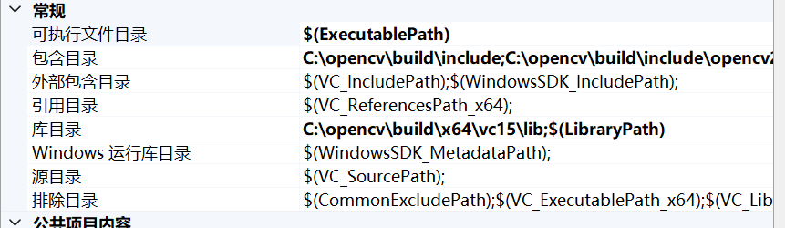
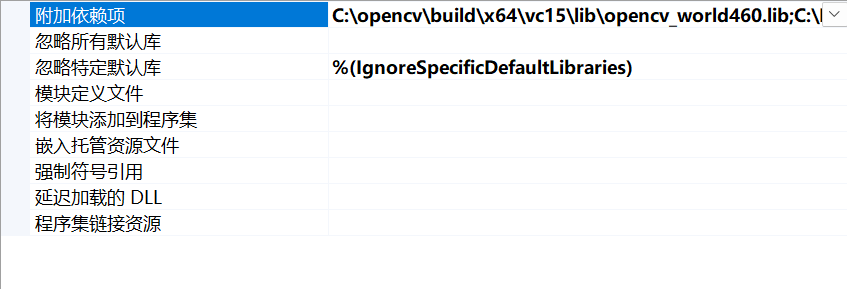

# UnetNoise
## 环境配置
C++部署环境
- libtorch 2.1.1
- Opencv 4.6.0
- Visual Stdio 2022

python训练Unet环境
- pytorch 2.1.1
- python 3.9.x
### 项目配置
- 使用vs2022编译器和cmake构建项目
- 在vs2022项目中加入Opencv的头文件，库文件以及在链接器输入中加入Opencv的静态链接库
  
  
### 配置成功结果

## 算法
### Unet网络结构

### 数据集

### Opencv锐化算法