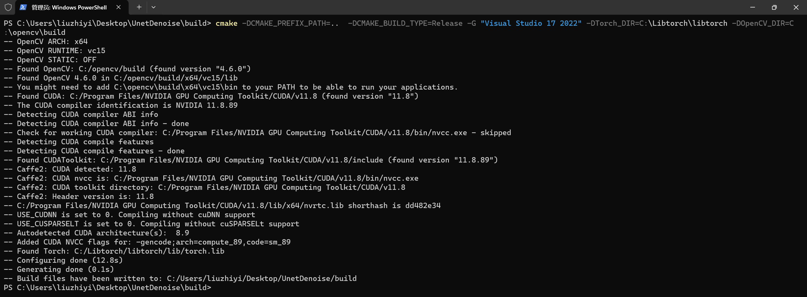

# UnetNoise
## 环境配置
C++部署环境
- libtorch 2.1.1 cuda版本
- Opencv 4.6.0
- Visual Stdio 2022
- 编译器(版本不知道)：MSVC++ 14.3
- CUDA 12.1
- CUDNN 8.9.6

python训练Unet环境
- pytorch 2.1.1 CUDA版本
- python 3.9.x
### 项目配置
- 使用vs2022编译器和cmake构建项目
~~~shell
set(OpenCV_DIR "C:/opencv/build")
set(Torch_DIR "C:/Libtorch/libtorch/share/cmake/Torch")
# find_package(CUDA REQUIRED)
find_package(OpenCV REQUIRED)
find_package(Torch REQUIRED)

add_executable(DNOISE Denoise.cpp)
target_include_directories(DNOISE PUBLIC ${OpenCV_INCLUDE_DIRS})
target_link_libraries(DNOISE ${TORCH_LIBRARIES} ${OpenCV_LIBS})
~~~

### 配置成功结果

## 算法
### Unet网络结构

### 数据集
- 使用CIFAR-10数据集进行人工加噪声后；根据正常图片和噪声图片进行训练

### Opencv锐化算法
- 使用UML锐化算法
  ~~~c++
  // USM sharpening
  cv::bilateralFilter(m_image_, dst, 5, 120, 3);
  cv::filter2D(dst, result, -1, kernal, cv::Point(-1, -1), 0);
  ~~~

## 类设计

## 后端算法流程

## 补充
- 我们实现的Unet
~~~shell
~~~shell
BaseUNet(
  (trans1): TransitionBlock(
    (conv1): Conv2d(3, 8, kernel_size=(1, 1), stride=(1, 1))
    (pool): MaxPool2d(kernel_size=3, stride=1, padding=1, dilation=1, ceil_mode=False)
    (conv2): Conv2d(3, 8, kernel_size=(1, 1), stride=(1, 1))
    (conv31): Conv2d(3, 8, kernel_size=(1, 1), stride=(1, 1))
    (conv32): Conv2d(8, 8, kernel_size=(3, 3), stride=(1, 1), padding=(1, 1))
    (conv41): Conv2d(3, 8, kernel_size=(1, 1), stride=(1, 1))
    (conv42): Conv2d(8, 8, kernel_size=(5, 5), stride=(1, 1), padding=(2, 2))
    (convf): Conv2d(32, 8, kernel_size=(3, 3), stride=(1, 1), padding=(1, 1))
    (batch_norm): BatchNorm2d(8, eps=1e-05, momentum=0.1, affine=True, track_running_stats=True)
    (relu): ReLU()
  )
  (down1): DownBlock(
    (conv1): Conv2d(8, 12, kernel_size=(3, 3), stride=(1, 1), padding=(1, 1))
    (conv2): Conv2d(8, 12, kernel_size=(3, 3), stride=(1, 1), padding=(3, 3), dilation=(3, 3))
    (conv3): Conv2d(8, 12, kernel_size=(3, 3), stride=(1, 1), padding=(5, 5), dilation=(5, 5))
    (conv4): Conv2d(36, 16, kernel_size=(3, 3), stride=(2, 2), padding=(1, 1))
    (conv5): Conv2d(16, 16, kernel_size=(1, 1), stride=(1, 1))
    (batch_norm): BatchNorm2d(16, eps=1e-05, momentum=0.1, affine=True, track_running_stats=True)
    (relu): ReLU()
  )
  (down2): DownBlock(
    (conv1): Conv2d(16, 24, kernel_size=(3, 3), stride=(1, 1), padding=(1, 1))
    (conv2): Conv2d(16, 24, kernel_size=(3, 3), stride=(1, 1), padding=(3, 3), dilation=(3, 3))
    (conv3): Conv2d(16, 24, kernel_size=(3, 3), stride=(1, 1), padding=(5, 5), dilation=(5, 5))
    (conv4): Conv2d(72, 32, kernel_size=(3, 3), stride=(2, 2), padding=(1, 1))
    (conv5): Conv2d(32, 32, kernel_size=(1, 1), stride=(1, 1))
    (batch_norm): BatchNorm2d(32, eps=1e-05, momentum=0.1, affine=True, track_running_stats=True)
    (relu): ReLU()
  )
  (down3): DownBlock(
    (conv1): Conv2d(32, 48, kernel_size=(3, 3), stride=(1, 1), padding=(1, 1))
    (conv2): Conv2d(32, 48, kernel_size=(3, 3), stride=(1, 1), padding=(3, 3), dilation=(3, 3))
    (conv3): Conv2d(32, 48, kernel_size=(3, 3), stride=(1, 1), padding=(5, 5), dilation=(5, 5))
    (conv4): Conv2d(144, 64, kernel_size=(3, 3), stride=(2, 2), padding=(1, 1))
    (conv5): Conv2d(64, 64, kernel_size=(1, 1), stride=(1, 1))
    (batch_norm): BatchNorm2d(64, eps=1e-05, momentum=0.1, affine=True, track_running_stats=True)
    (relu): ReLU()
  )
  (down4): DownBlock(
    (conv1): Conv2d(64, 80, kernel_size=(3, 3), stride=(1, 1), padding=(1, 1))
    (conv2): Conv2d(64, 80, kernel_size=(3, 3), stride=(1, 1), padding=(3, 3), dilation=(3, 3))
    (conv3): Conv2d(64, 80, kernel_size=(3, 3), stride=(1, 1), padding=(5, 5), dilation=(5, 5))
    (conv4): Conv2d(240, 96, kernel_size=(3, 3), stride=(2, 2), padding=(1, 1))
    (conv5): Conv2d(96, 96, kernel_size=(1, 1), stride=(1, 1))
    (batch_norm): BatchNorm2d(96, eps=1e-05, momentum=0.1, affine=True, track_running_stats=True)
    (relu): ReLU()
  )
  (down5): DownBlock(
    (conv1): Conv2d(96, 112, kernel_size=(3, 3), stride=(1, 1), padding=(1, 1))
    (conv2): Conv2d(96, 112, kernel_size=(3, 3), stride=(1, 1), padding=(3, 3), dilation=(3, 3))
    (conv3): Conv2d(96, 112, kernel_size=(3, 3), stride=(1, 1), padding=(5, 5), dilation=(5, 5))
    (conv4): Conv2d(336, 128, kernel_size=(3, 3), stride=(2, 2), padding=(1, 1))
    (conv5): Conv2d(128, 128, kernel_size=(1, 1), stride=(1, 1))
    (batch_norm): BatchNorm2d(128, eps=1e-05, momentum=0.1, affine=True, track_running_stats=True)
    (relu): ReLU()
  )
  (trans2): TransitionBlock(
    (conv1): Conv2d(128, 256, kernel_size=(1, 1), stride=(1, 1))
    (pool): MaxPool2d(kernel_size=3, stride=1, padding=1, dilation=1, ceil_mode=False)
    (conv2): Conv2d(128, 256, kernel_size=(1, 1), stride=(1, 1))
    (conv31): Conv2d(128, 256, kernel_size=(1, 1), stride=(1, 1))
    (conv32): Conv2d(256, 256, kernel_size=(3, 3), stride=(1, 1), padding=(1, 1))
    (conv41): Conv2d(128, 256, kernel_size=(1, 1), stride=(1, 1))
    (conv42): Conv2d(256, 256, kernel_size=(5, 5), stride=(1, 1), padding=(2, 2))
    (convf): Conv2d(1024, 256, kernel_size=(3, 3), stride=(1, 1), padding=(1, 1))
    (batch_norm): BatchNorm2d(256, eps=1e-05, momentum=0.1, affine=True, track_running_stats=True)
    (relu): ReLU()
  )
  (dense): DenseBlock(
    (conv1): Conv2d(256, 12, kernel_size=(3, 3), stride=(1, 1), padding=(1, 1))
    (batch_norm): BatchNorm2d(12, eps=1e-05, momentum=0.1, affine=True, track_running_stats=True)
    (conv2): Conv2d(268, 12, kernel_size=(3, 3), stride=(1, 1), padding=(1, 1))
    (conv3): Conv2d(280, 256, kernel_size=(3, 3), stride=(1, 1), padding=(1, 1))
    (batch_norm3): BatchNorm2d(256, eps=1e-05, momentum=0.1, affine=True, track_running_stats=True)
    (relu): ReLU()
  )
  (up1): UpBlock(
    (conv1): Conv2d(384, 240, kernel_size=(3, 3), stride=(1, 1), padding=(1, 1))
    (upsample): Upsample(scale_factor=2.0, mode='bilinear')
    (conv_compensate): Conv2d(240, 96, kernel_size=(3, 3), stride=(1, 1), padding=(1, 1))
    (conv2): Conv2d(96, 96, kernel_size=(3, 3), stride=(1, 1), padding=(1, 1))
    (batch_norm): BatchNorm2d(96, eps=1e-05, momentum=0.1, affine=True, track_running_stats=True)
    (relu): ReLU()
  )
  (up2): UpBlock(
    (conv1): Conv2d(192, 128, kernel_size=(3, 3), stride=(1, 1), padding=(1, 1))
    (upsample): Upsample(scale_factor=2.0, mode='bilinear')
    (conv_compensate): Conv2d(128, 64, kernel_size=(3, 3), stride=(1, 1), padding=(1, 1))
    (conv2): Conv2d(64, 64, kernel_size=(3, 3), stride=(1, 1), padding=(1, 1))
    (batch_norm): BatchNorm2d(64, eps=1e-05, momentum=0.1, affine=True, track_running_stats=True)
    (relu): ReLU()
  )
  (up3): UpBlock(
    (conv1): Conv2d(128, 80, kernel_size=(3, 3), stride=(1, 1), padding=(1, 1))
    (upsample): Upsample(scale_factor=2.0, mode='bilinear')
    (conv_compensate): Conv2d(80, 32, kernel_size=(3, 3), stride=(1, 1), padding=(1, 1))
    (conv2): Conv2d(32, 32, kernel_size=(3, 3), stride=(1, 1), padding=(1, 1))
    (batch_norm): BatchNorm2d(32, eps=1e-05, momentum=0.1, affine=True, track_running_stats=True)
    (relu): ReLU()
  )
  (up4): UpBlock(
    (conv1): Conv2d(64, 40, kernel_size=(3, 3), stride=(1, 1), padding=(1, 1))
    (upsample): Upsample(scale_factor=2.0, mode='bilinear')
    (conv_compensate): Conv2d(40, 16, kernel_size=(3, 3), stride=(1, 1), padding=(1, 1))
    (conv2): Conv2d(16, 16, kernel_size=(3, 3), stride=(1, 1), padding=(1, 1))
    (batch_norm): BatchNorm2d(16, eps=1e-05, momentum=0.1, affine=True, track_running_stats=True)
    (relu): ReLU()
  )
  (up5): UpBlock(
    (conv1): Conv2d(32, 24, kernel_size=(3, 3), stride=(1, 1), padding=(1, 1))
    (upsample): Upsample(scale_factor=2.0, mode='bilinear')
    (conv_compensate): Conv2d(24, 16, kernel_size=(3, 3), stride=(1, 1), padding=(1, 1))
    (conv2): Conv2d(16, 16, kernel_size=(3, 3), stride=(1, 1), padding=(1, 1))
    (batch_norm): BatchNorm2d(16, eps=1e-05, momentum=0.1, affine=True, track_running_stats=True)
    (relu): ReLU()
  )
  (conv_last): Conv2d(16, 3, kernel_size=(1, 1), stride=(1, 1))
)
Number of parameters in the model: 8268663
~~~

~~~