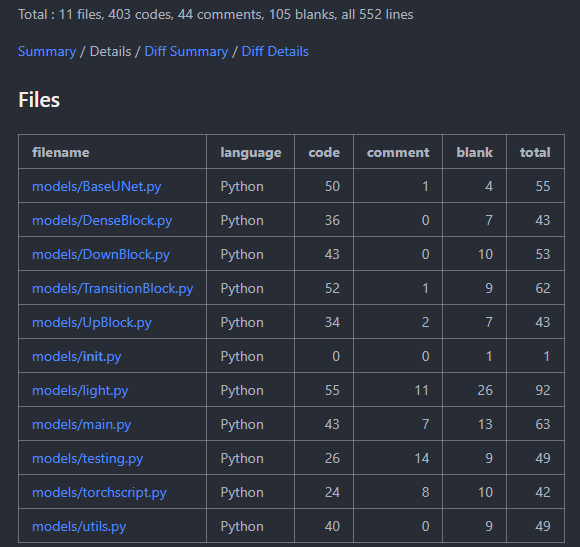

# UnetNoise
## 环境配置
C++部署环境
- libtorch 2.1.1 cuda版本
- Opencv 4.6.0
- Visual Stdio 2022
- 编译器(版本不知道)：MSVC++ 14.3
- CUDA 11.8
- CUDNN 8.9.6

python训练Unet环境
- pytorch 2.1.1 CUDA版本
- python 3.9.x
### 项目配置
- 使用vs2022编译器和cmake构建项目
~~~shell
set(OpenCV_DIR "C:/opencv/build")
set(Torch_DIR "C:/Libtorch/libtorch/share/cmake/Torch")
# find_package(CUDA REQUIRED)
find_package(OpenCV REQUIRED)
find_package(Torch REQUIRED)

add_executable(DNOISE Denoise.cpp)
target_include_directories(DNOISE PUBLIC ${OpenCV_INCLUDE_DIRS})
target_link_libraries(DNOISE ${TORCH_LIBRARIES} ${OpenCV_LIBS})
~~~
### 配置成功结果

## 算法
### Unet网络结构

### 数据集
- 使用CIFAR-10数据集进行人工加噪声后；根据正常图片和噪声图片进行训练

### Opencv锐化算法
- 使用UML锐化算法
  ~~~c++
  // USM sharpening
  cv::bilateralFilter(m_image_, dst, 5, 120, 3);
  cv::filter2D(dst, result, -1, kernal, cv::Point(-1, -1), 0);
  ~~~
## 代码
### 类设计
、
### 后端算法执行流程

### C++部署

### Python模型构建
