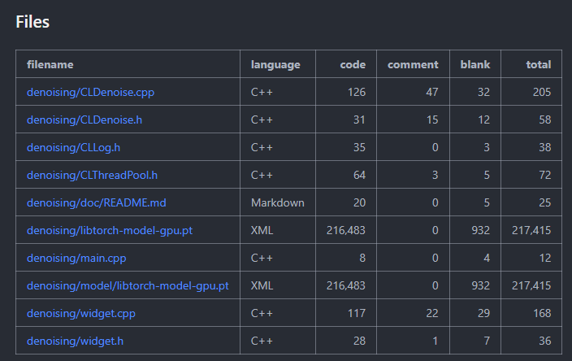

# UnetNoise
## 环境配置
C++部署环境
- libtorch 2.1.1 cuda版本
- Opencv 4.6.0
- Visual Stdio 2022
- 编译器(版本不知道)：MSVC++ 14.3
- CUDA 12.1
- CUDNN 8.9.6

python训练Unet环境
- pytorch 2.1.1 CUDA版本
- python 3.9.x
### 项目配置
- 使用vs2022编译器和cmake构建项目
~~~shell
set(OpenCV_DIR "C:/opencv/build")
set(Torch_DIR "C:/Libtorch/libtorch/share/cmake/Torch")
# find_package(CUDA REQUIRED)
find_package(OpenCV REQUIRED)
find_package(Torch REQUIRED)

add_executable(DNOISE Denoise.cpp)
target_include_directories(DNOISE PUBLIC ${OpenCV_INCLUDE_DIRS})
target_link_libraries(DNOISE ${TORCH_LIBRARIES} ${OpenCV_LIBS})
~~~

### 配置成功结果

## 算法
### Unet网络结构

### 数据集
- 使用CIFAR-10数据集进行人工加噪声后；根据正常图片和噪声图片进行训练

### Opencv锐化算法
- 使用UML锐化算法
  ~~~c++
  // USM sharpening
  cv::bilateralFilter(m_image_, dst, 5, 120, 3);
  cv::filter2D(dst, result, -1, kernal, cv::Point(-1, -1), 0);
  ~~~

## 类设计

## 后端算法流程

## 补充

### TransitionBlock

### DownBlock

### DenseBlock

### UpBlock

### 我们的Unet结构
~~~shell
BaseUNet                                 [1, 3, 128, 128]          
├─TransitionBlock: 1-1                   [1, 8, 128, 128]          
├─DownBlock: 1-2                         [1, 16, 64, 64]           
├─DownBlock: 1-3                         [1, 32, 32, 32]           
├─DownBlock: 1-4                         [1, 64, 16, 16]           
├─DownBlock: 1-5                         [1, 96, 8, 8]             
├─DownBlock: 1-6                         [1, 128, 4, 4]            
├─TransitionBlock: 1-7                   [1, 256, 4, 4]            
├─DenseBlock: 1-8                        [1, 256, 4, 4]            
├─UpBlock: 1-9                           [1, 96, 8, 8]             
├─UpBlock: 1-10                          [1, 64, 16, 16]           
├─UpBlock: 1-13                          [1, 16, 128, 128]         
├─Conv2d: 1-14                           [1, 3, 128, 128]          
~~~

~~~